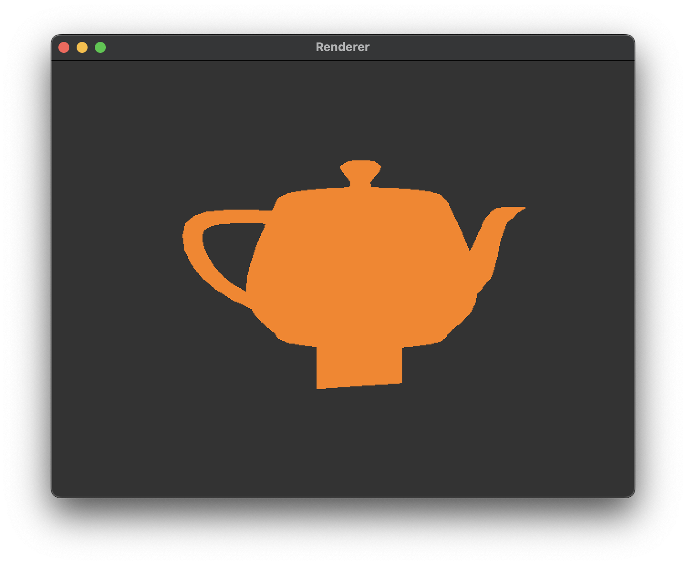

# OpenGL Renderer

- [x] Camera
- [ ] Add UI
- [ ] Support to translate meshes
- [ ] Support multiple meshes
- [ ] Support for shading


<div align="center">
  
</div>


## Prerequisites
- **CMake**
- **Clang**: Only tested with Clang so far. Can check your version (if installed) with:
```bash
  clang --version
```

## Build Instructions
### Windows
```bash
  build.bat
```
### macOS
```bash
  chmod+x build.sh
  build.sh
```

These scripts will:
- Fetch necessary libraries using CMake.
- Compile the project.
- Run the program.
